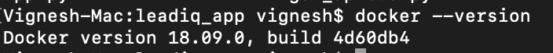
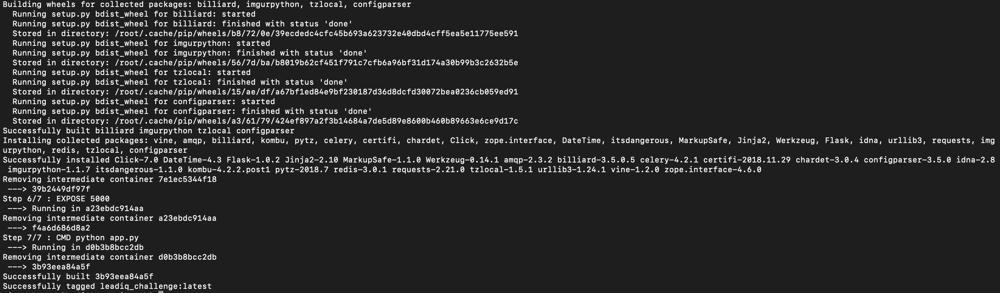
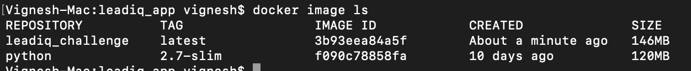
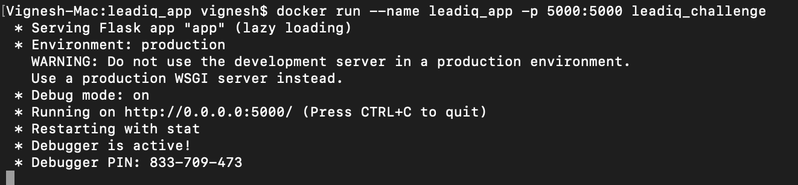
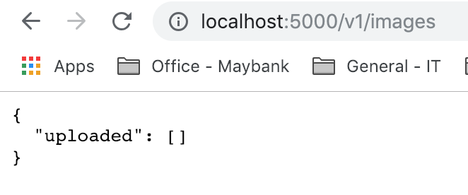
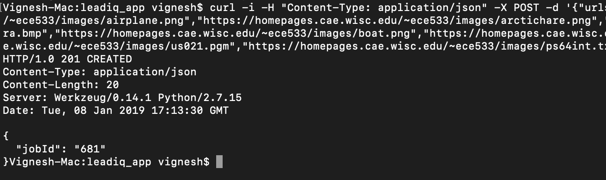
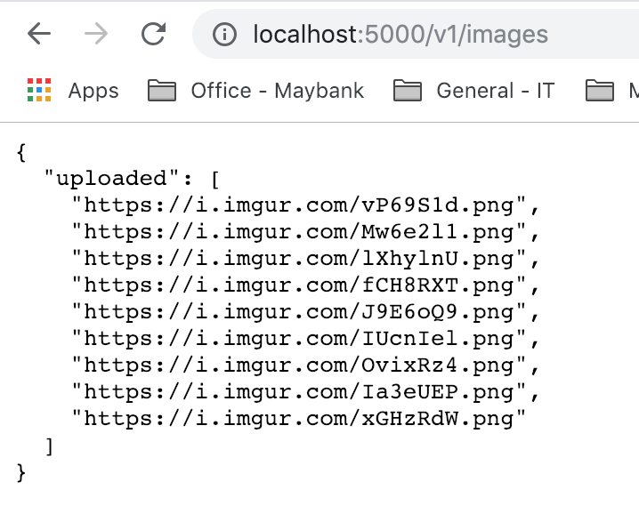
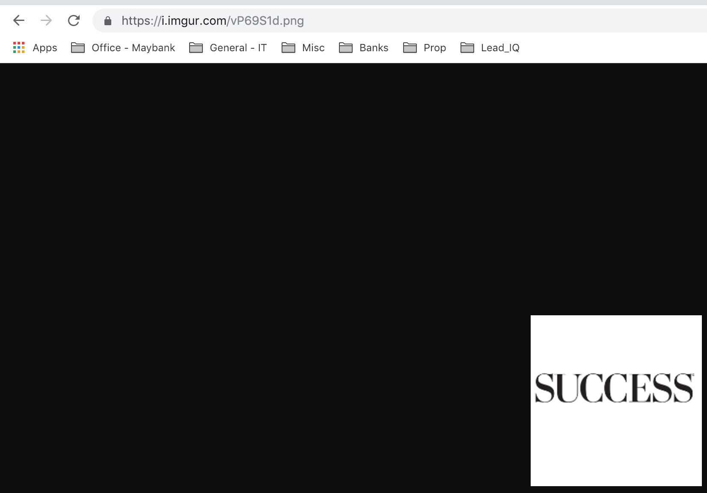

## Pre-Requistes 

1. [Docker](https://www.docker.com/products/docker-desktop) 
2. [Any Browser](https://www.google.com/chrome/browser/desktop/index.html) to view the response for GET method
3. [Postman](https://www.getpostman.com/downloads) or [Curl](https://curl.haxx.se/download.html) to push data through POST method for uploading to Imgur
4. [Git](https://git-scm.com/downloads) (Optional)

## Building Docker Image 

To check if you're having docker, execute command ```docker --version```, you should see something similar below,



Once repository files have been cloned/downloaded to your localhost, Please use following command to build docker image,

1. Navigate to directory **leadiq_app** where repository files are downloaded 
2. Then run ```docker build --tag leadiq_challenge .``` from your terminal(Mac OS/Linux flavoured machines) or Command Prompt (Windows)
3. Upon successful completion, you should see something similar below,

    

4. You can view the successfully built image using command ```docker image ls```

    

5. Once build is successful, you can start the service with command ```docker run --name leadiq_app -p 5000:5000 leadiq_challenge```

    

6. By this time, our service has already started running, you can verify by navigating to ```http://localhost:5000/v1/images```, you should see an empty JSON response as below,

    


---

## Teting the Service

Now that our service is up and running, let's test the functionality with some URL's, I'm using curl to pass POST method to the service, you can use any app or command that you're familier with,

1. I'm running **CURL** with 9 images & 1 text file to POST method of the service.
	a. First service will download all the images to Images folder within app setup, if URL is not downloadable, it will update the **FAILED** Struct with URL & Reason for failure. 
	b. Then once all the URL's in given input array has been consumed, it will start uploading to Imgur upon successfull access_token retrieval. 
	c. Refresh Token & Client ID/Secret are embedded into auth.ini file. 
	d. You can use below command for your testing if you already have installed CURL in your machine,
    
	```
    curl -i -H "Content-Type: application/json" -X POST -d '{"urls":["http://asppoolco.com/wp-content/uploads/2018/01/success-magazine-logo.png","https://homepages.cae.wisc.edu/~ece533/images/airplane.png","https://homepages.cae.wisc.edu/~ece533/images/arctichare.png","https://homepages.cae.wisc.edu/~ece533/images/baboon.png","https://homepages.cae.wisc.edu/~ece533/images/barbara.bmp","https://homepages.cae.wisc.edu/~ece533/images/boat.png","https://homepages.cae.wisc.edu/~ece533/images/boy.ppm","https://homepages.cae.wisc.edu/~ece533/images/cameraman.tif","https://homepages.cae.wisc.edu/~ece533/images/us021.pgm","https://homepages.cae.wisc.edu/~ece533/images/ps64int.txt"]}' http://localhost:5000/v1/images/upload
    ```

2. Once request is submitted, service will immediately respone with unique random number generated within the app as below,

    

3. Once Job is submitted, you can view the status on URL ```http://localhost:5000/v1/images/upload/{{job_id}}```, Invalid job ID will return error Json as configured within the serice. Output of above job below,

    

4. **Hurray!!** As expected, our service returned Imgur links and for failed URL, it has logged a short reason why that particular URL was ignored or failed to upload. 
5. All successfully processed images are stored within a data Struct, you can view them with ```http://localhost:5000/v1/images```

    

6. You can directly view the images with returned Imgur links as one of the sample below,

    

*Note: I've deleted already uploaded imgur images as part of this testing from my profile, as the service directly uploads images to my user profile.*

---

## Clone a repository

Use these steps to clone from SourceTree, our client for using the repository command-line free. Cloning allows you to work on your files locally. If you don't yet have SourceTree, [download and install first](https://www.sourcetreeapp.com/). If you prefer to clone from the command line, see [Clone a repository](https://confluence.atlassian.com/x/4whODQ).

1. You'll see the clone button under the **Source** heading. Click that button.
2. Now click **Check out in SourceTree**. You may need to create a SourceTree account or log in.
3. When you see the **Clone New** dialog in SourceTree, update the destination path and name if you'd like to and then click **Clone**.
4. Open the directory you just created to see your repository files.
